### header
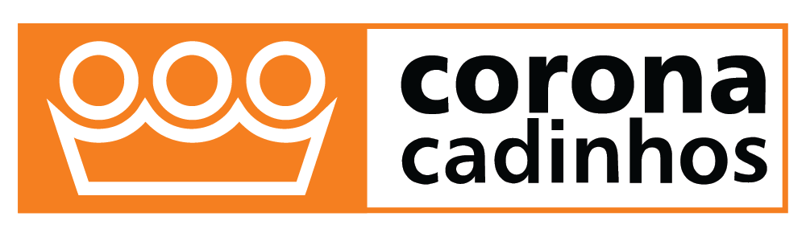
submenus home quem somos produtos loja virtual universidade_corona contatos

### hero 
bg: 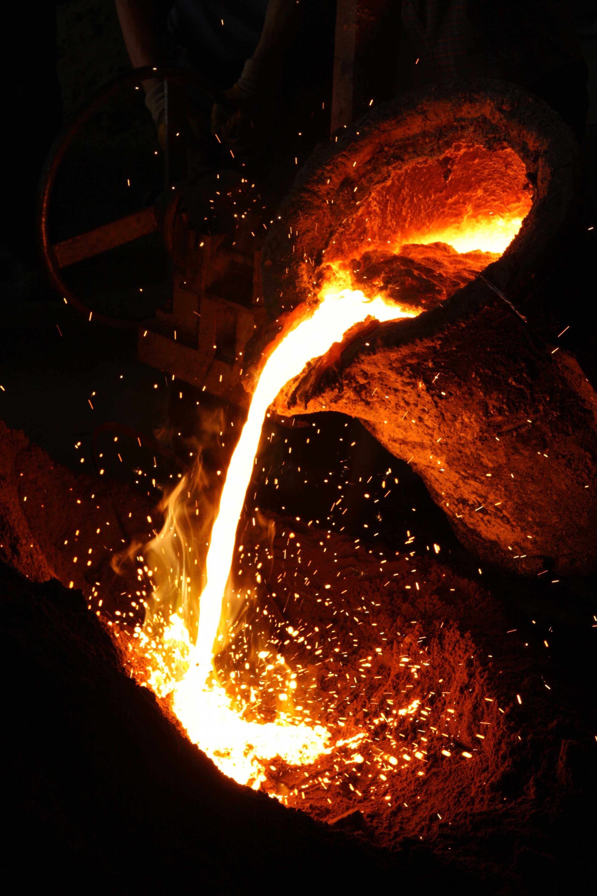
Líder Nacional em Fornecimento de Produtos e Insumos para Fundição

### Uma Indústria 100% Brasileira, com Sucesso Mundial
A Corona Cadinhos é líder no mercado nacional e reconhecida internacionalmente por fornecer produtos para mais de 35 países.

Cadinhos de Carbeto de Silício
Cadinhos de Grafite/Argila
Fornos para cadinhos
Peças do Perfil

botao baixar catalogo completo 

### topicos
Soluções Inteligentes e Customizadas
Em vista dos inúmeros desenvolvimentos exigidos pelo mercado, temos um setor especializado no desenvolvimento de projetos para proporcionar a melhor atualização aos nossos clientes.

Produtividade com o Melhor Custo Benefício
Visando sempre o bem-estar do cliente, desenvolvemos produtos para proporcionar a melhor qualidade e durabilidade para as fundições.

Suporte Técnico Qualificado
A Corona Cadinhos disponibiliza um setor de suporte técnico com excelentes profissionais treinados no ramo de fundição para fornecer excelente atendimento e suporte.

### Conheça Nosso Portfólio
Os produtos ideais para a fundição de metais não ferrosos

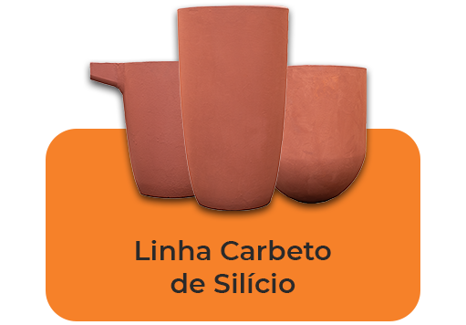
Linha Carbeto
de Silício

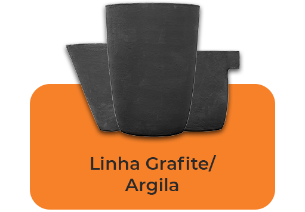
Linha Grafite/
Argila

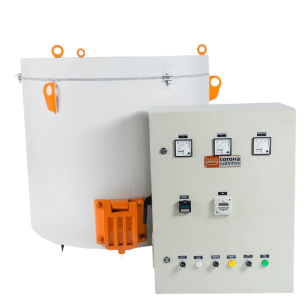
Fornos Eletricos,
a Gás e a Óleo

Filtros Corona

Panelas de 
Transferência e
Peças Monolíticas

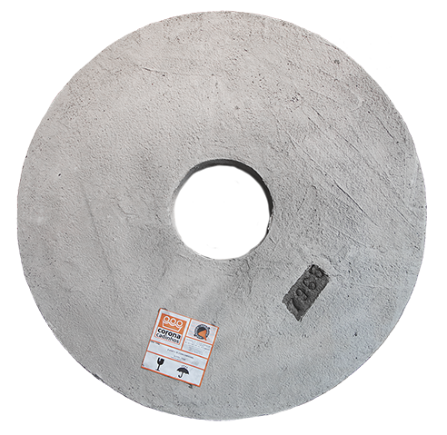
Tampas de
Concreto

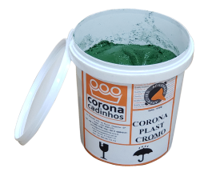
Massas Plásticas e
Massas Moldaveis

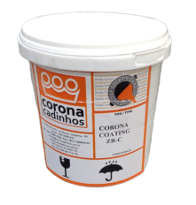
Corona
Coatings

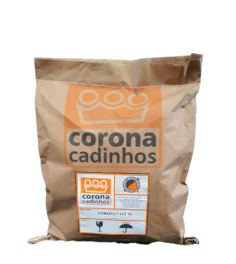
Concretos
Refratários

botao ver produtos
botao catalogo completo

### Atuamos em Todos os Continentes
A Corona Cadinhos é líder no mercado nacional e reconhecida internacionalmente por fornecer produtos para todos os continentes.
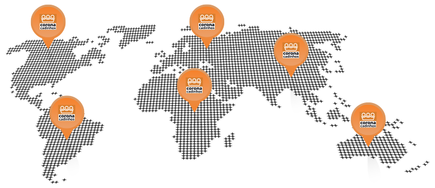

### Avaliações de Quem Já Comprou Corona Cadinhos

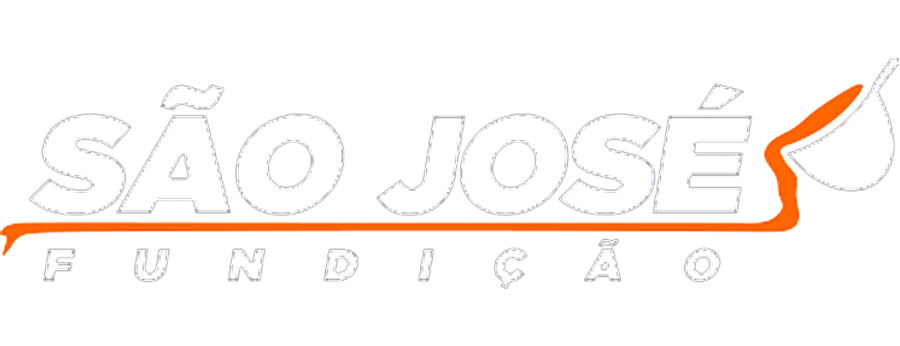
São José Fundição
Excelente produto, qualidade incomparável. Utilizamos os cadinhos da Corona há muitos anos e nunca nos decepcionou.

WG Fundição
Ótimo atendimento e produtos de alta qualidade. Recomendamos a todos do setor de fundição.

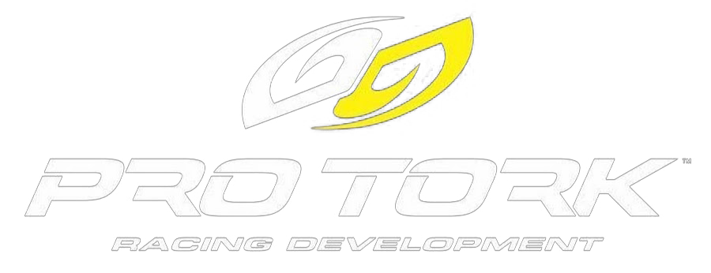
Pro Tork
Parceria de longa data. Produtos confiáveis e suporte técnico exemplar da equipe Corona.

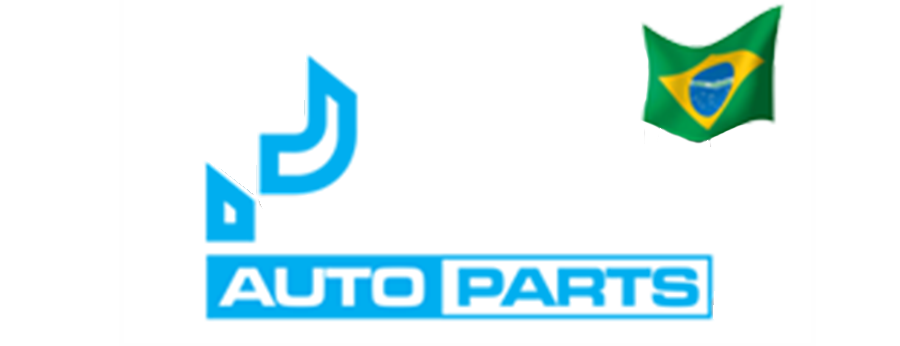
Rei Auto Parts
Qualidade reconhecida internacionalmente. Os melhores cadinhos do mercado sem dúvida.

carrossel clientes

### Presença Global
Acompanhe a nossa presença nas maiores feiras e eventos internacionais do segmento de fundição.
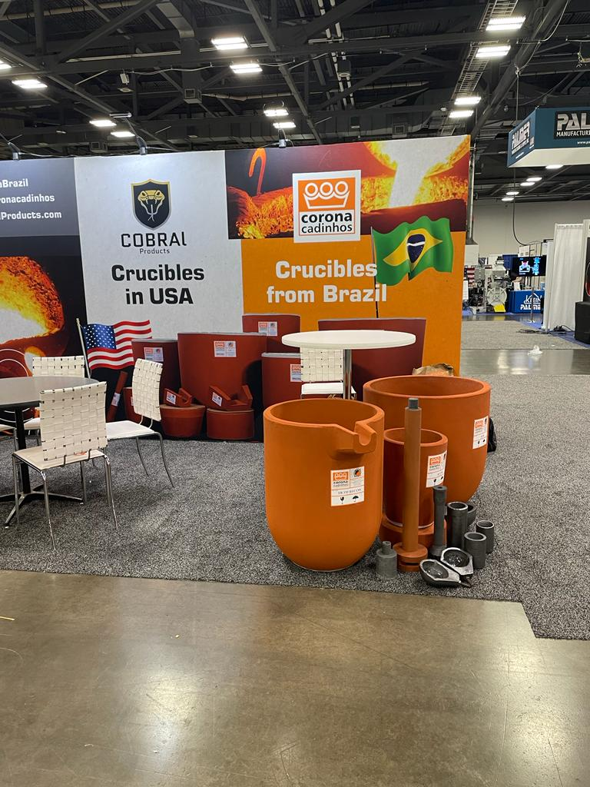
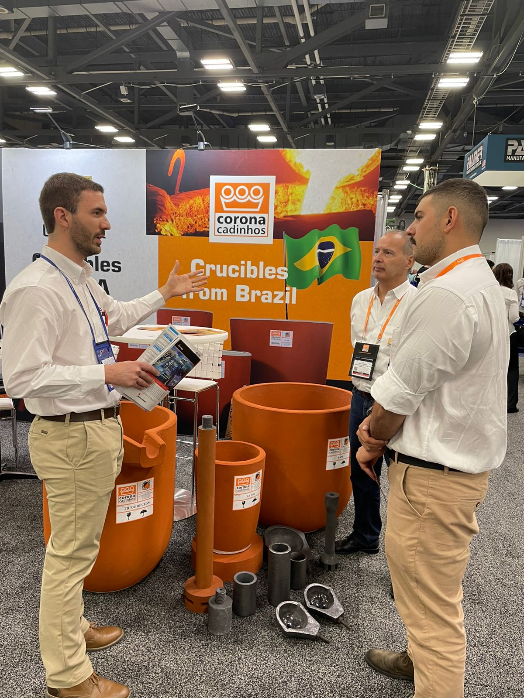
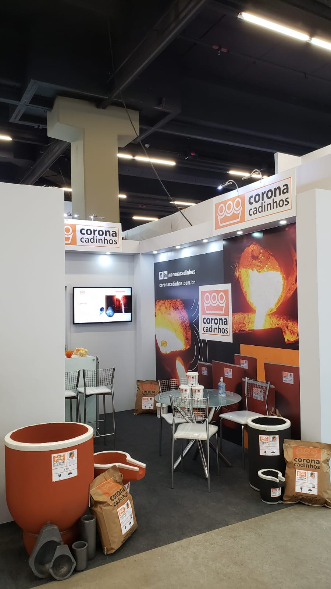

### Qualidade Reconhecida Internacionalmente
bg: 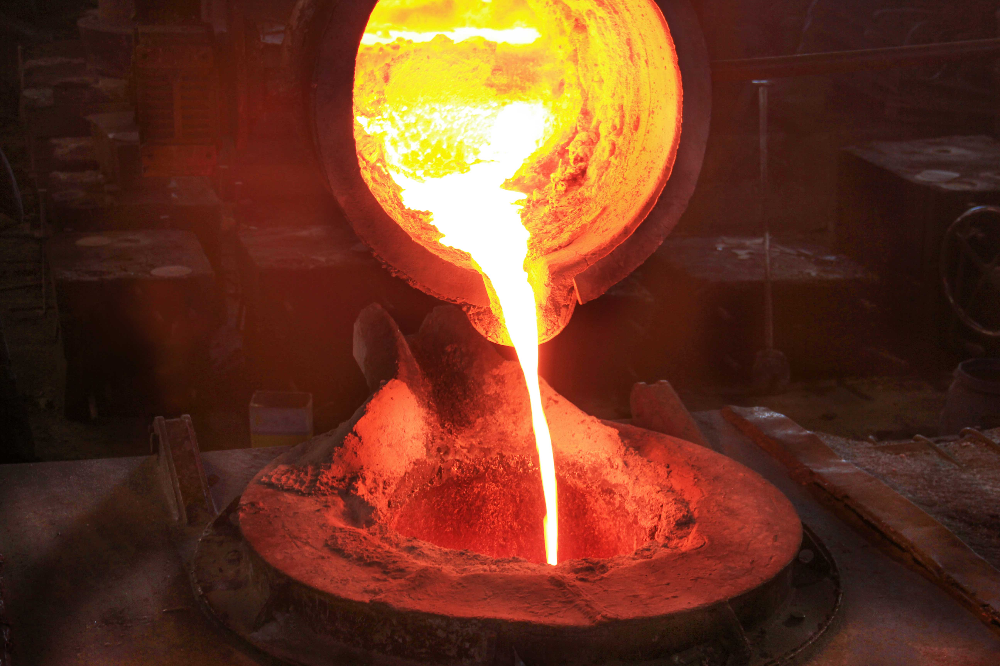

### footer

Av. Tiburcio, 478 – Casa Grande, Diadema – SP
+55 11 96334-3339
+55 11 4061-7789

### Conheça a Corona Cadinhos
video 

### Nossa História
Fundada em Diadema, São Paulo, a Corona Cadinhos nasceu como uma empresa produzindo uma pequena linha de produtos de carbeto de silício, que inclui cadinhos, bases, lixas e cimento para pequenas fusões.

Afirmada com seu compromisso firme com seus clientes, em pouco tempo a empresa passou a vender para toda a América Latina. Em 1981 exportou seu primeiro cadinho para a América do Norte e, a Alemanha, tornando-se a primeira empresa de capital 100% nacional a fazer parte do mercado internacional de fundição na Inglaterra, e finalmente começou a fazer parte do mercado internacional.

Já em 1997, a Corona consolidou sua posição no mercado internacional, participando do CIF na Alemanha, tornando-se assim a única empresa de capital 100% nacional. Desde então, a Corona sempre está presente em todas as articulações mais importantes em todo o setor de fundição. Atualmente, a Corona Cadinhos é líder no mercado nacional e reconhecida internacionalmente pela qualidade de seus produtos, oferecendo uma completa linha de cadinhos de carbeto de silício e grafite – argila, fornos e produtos de tratamento de metais não-ferrosos.

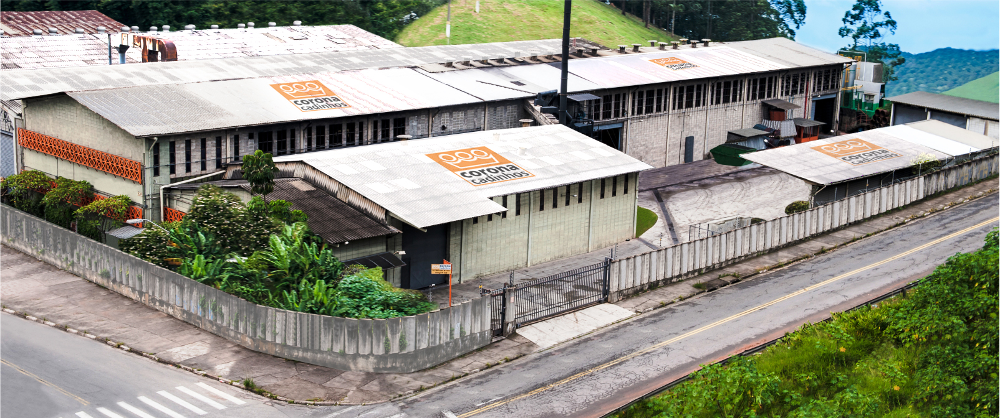

### Certificação ISO 9001

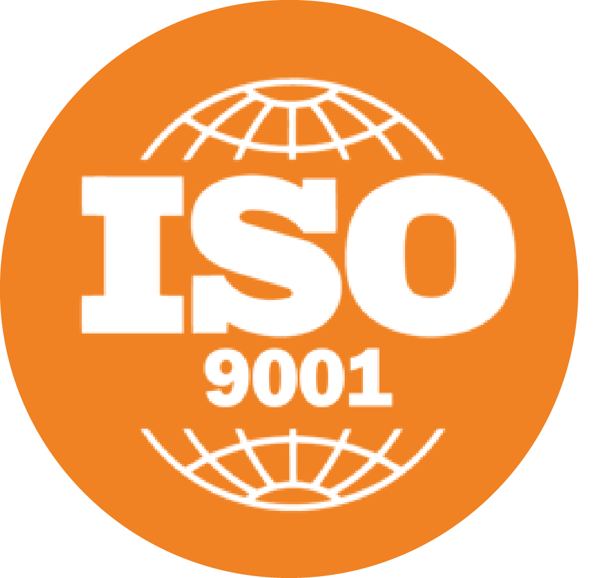
Os objetivos da empresa sempre estiveram voltados para a prestação de um ótimo atendimento aos clientes, com pronta-entrega de produtos e visando a qualidade. A Corona foi a primeira empresa do segmento no Brasil a conquistar a certificação ISO 9001:1998, processo essencial no nosso compromisso pela qualidade.

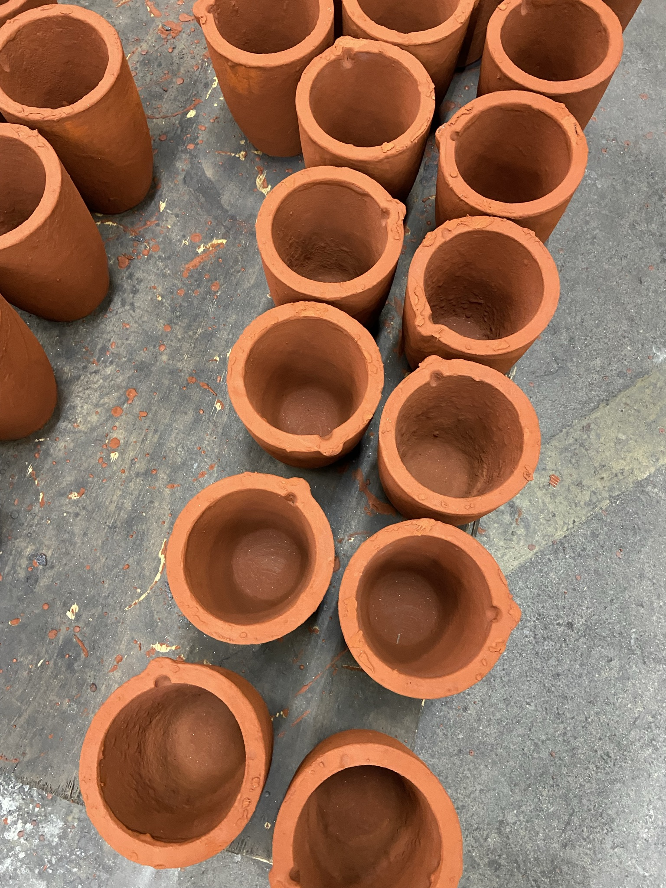
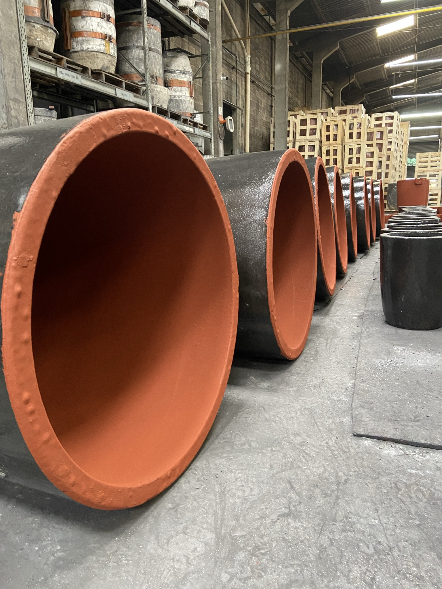
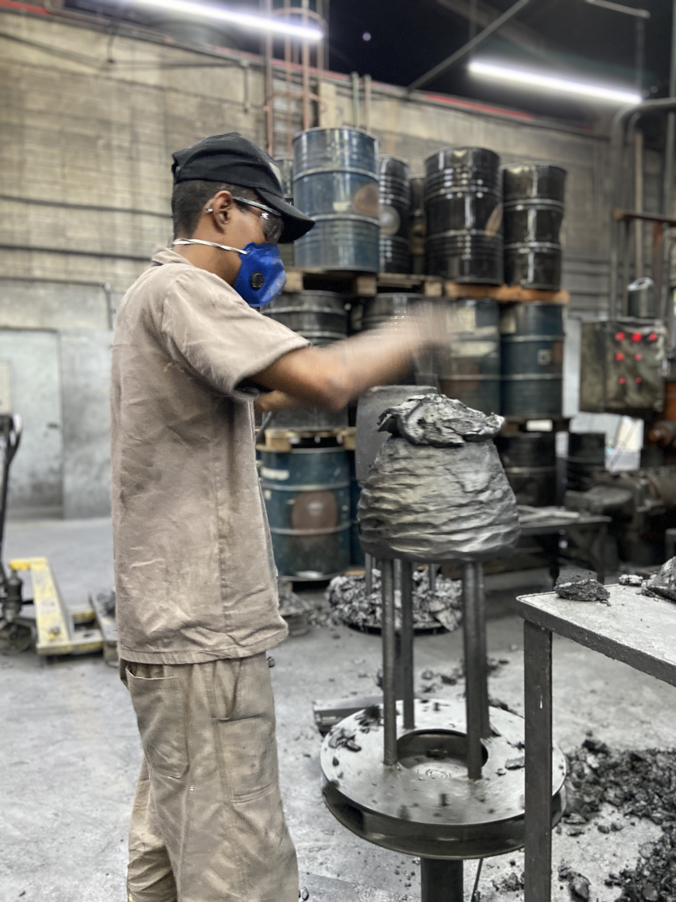

### Política da Qualidade
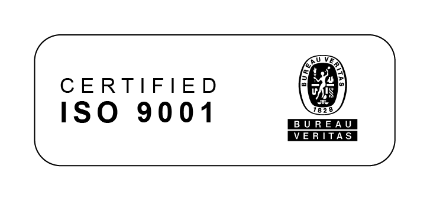
certificado
https://drive.google.com/file/d/1G60NHZzyJ-UhUEB7WUjL7QnSxySklzPD/view

A Corona Cadinhos, empresa nacional fabricante de cadinhos e componentes para fundição, atua no mercado nacional e internacional, buscando superar as necessidades e expectativas de seus clientes.

Para atingir nossos objetivos buscamos:

→
Comprometer e atender às necessidades dos clientes;
→
Buscar melhorias contínuas dos nossos produtos;
→
Buscar o desenvolvimento do quadro funcional;
→
Perseguir a melhoria contínua do sistema, através do atendimento dos requisitos do sistema de gestão de qualidade.

### produtos

Filtros Corona

Panelas de 
Transferência e
Peças Monolíticas

Tampas de
Concreto

Massas Plásticas e
Massas Moldaveis

Corona
Coatings

Concretos
Refratários

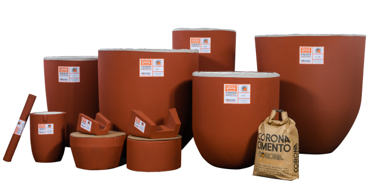
Linha Carbeto de Silício
Alta resistência e durabilidade para fundição de metais não ferrosos.

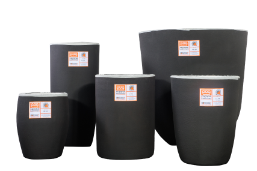
Linha Grafite/Argila
Excelente condutividade térmica e resistência a choques térmicos.

Corona Coatings
Revestimentos especiais para proteção e maior vida útil dos cadinhos.

Massas Plásticas e Massas Moldáveis
Soluções refratárias versáteis para diversos tipos de aplicação.

Fornos Elétricos, a Gás e a Óleo
Equipamentos de alta eficiência para fusão de metais.

Concretos Refratários
Resistência mecânica e térmica para aplicações industriais.

Filtros Corona
Filtragem eficiente para remoção de impurezas do metal fundido.

Panelas de Transferência e Peças Monolíticas
Transferência segura e eficiente de metal líquido.

Tampas de Concreto
Proteção térmica e contenção para fornos e cadinhos.

catalogo completo https://drive.google.com/file/d/1CHhtQaVbwdnlB49s5uWfgLt4sGybLemj/view

### O Melhor do Setor de Fundição
Linha Completa de Produtos para Fundição de Metais Ferrosos e Não Ferrosos
botao falar com vendendor

### universidade cadinho
### hero 
bg: 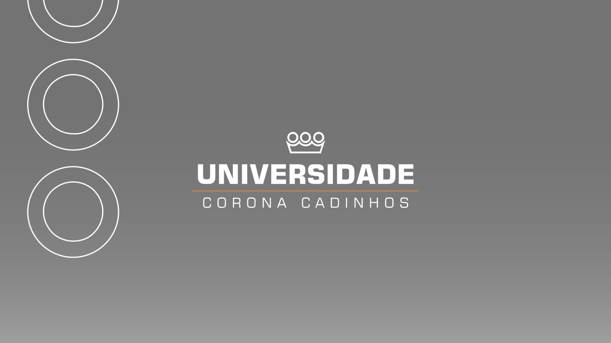

videos
Aprenda a usar os nossos cadinhos
Como estocar e manusear o cadinho após recebê-lo?
Como utilizar o cadinho de acordo com cada forno?

### contatos 
Informações de Contato
📍
Endereço
Av. Tiburcio, 478 – Casa Grande
Diadema – SP, Brasil

Telefones
+55 11 96334-3339
+55 11 4061-7789

✉️
Email
contato@coronacadinhos.com.br

https://www.instagram.com/coronacadinhos?utm_source=ig_web_button_share_sheet&igsh=ZDNlZDc0MzIxNw%3D%3D
https://www.linkedin.com/company/coronacadinhos/?originalSubdomain=br
loja https://coronacadinhos.commercesuite.com.br/

🕐
Horário de Atendimento
Segunda a Sexta: 08:00 - 18:00
Sábado: 08:00 - 12:00

formulario

### paleta
#E8640A
gradientes de #E8640A com branco e preto

###
###